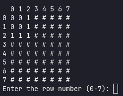

<p align="center">
  
</p>

<h3 align="center">
  Minesweeper game
</h3>

<blockquote align="center">
  Minesweeper game was built with TypeScript and runs directly from the system terminal.
</blockquote>
<br>

<p align="center">


</p>

<p align="center">
  <a href="#how-to-run-locally">How to run locally</a><br>
  <a href="#usefull-commands">Usefull commands</a><br>
</p>

## How to run locally

You can run the minesweeper game running the following:

```bash
npm install # Install the dependencies
npm run dev # Start the minesweeper game
```

## Usefull commands

<table>
  <thead>
    <tr>
      <th>Command</th>
      <th>Purpose</th>
    </tr>
  </thead>
  <tbody>
    <tr>
      <td><code>npm run dev</code></td>
      <td>Start the game for local development.</td>
    </tr>
    <tr>
      <td><code>npm build</code></td>
      <td>Build the application for production.</td>
    </tr>
    <tr>
      <td><code>npm run start</code></td>
      <td>Start the game using the dist (build) folder.</td>
    </tr>
  </tbody>
</table>
